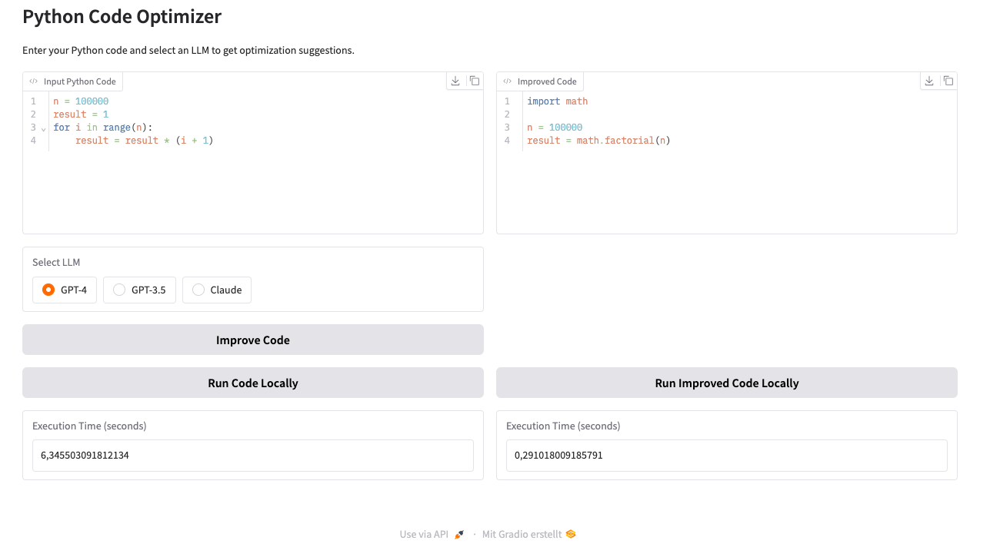

# Python Code Optimizer

A simple web interface for optimizing Python code using Large Language Models (LLMs).



## Features
- Optimize Python code using GPT-4, GPT-3.5, or Claude
- Run and compare execution times of original vs. optimized code
- Local execution in browser

## Setup
1. Clone the repository
2. Install dependencies:
```bash
conda env create -f environment.yml
conda activate LLMe
```

3. Set up environment variables:
```bash
cp .env.example .env
```
Then add your API keys to `.env`

4. Run the application:
```bash
python PyPolish/py_polish_app.py
```

## Usage
1. Paste your Python code in the left panel
2. Select an LLM model
3. Click "Improve Code" to get optimized version
4. Use "Run Code Locally" buttons to compare execution times