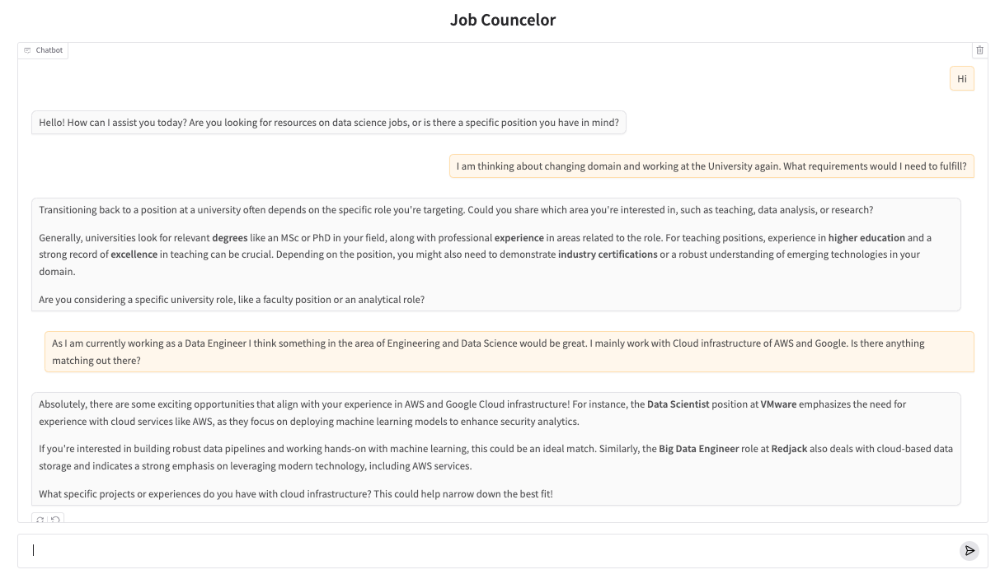

# Job Councelor for Data Science Jobs

Job Councelor is an AI-powered job counseling assistant that helps users explore and learn about current data science job opportunities by using RAG and OpenAI's GPT-4o model.
Dataset from [Kaggle](https://www.kaggle.com/datasets/diegosilvadefrana/2023-data-scientists-jobs-descriptions).

## Features

- Interactive chat interface using Gradio
- Conversation memory to maintain context
- Vector-based similarity search using FAISS

## How to Use

1. Clone the repository and install the dependencies.
2. Run the `app.py` file to start the Job Councelor.
3. Chat with the Job Councelor about data science jobs and get advice on how to prepare for the job interview.
